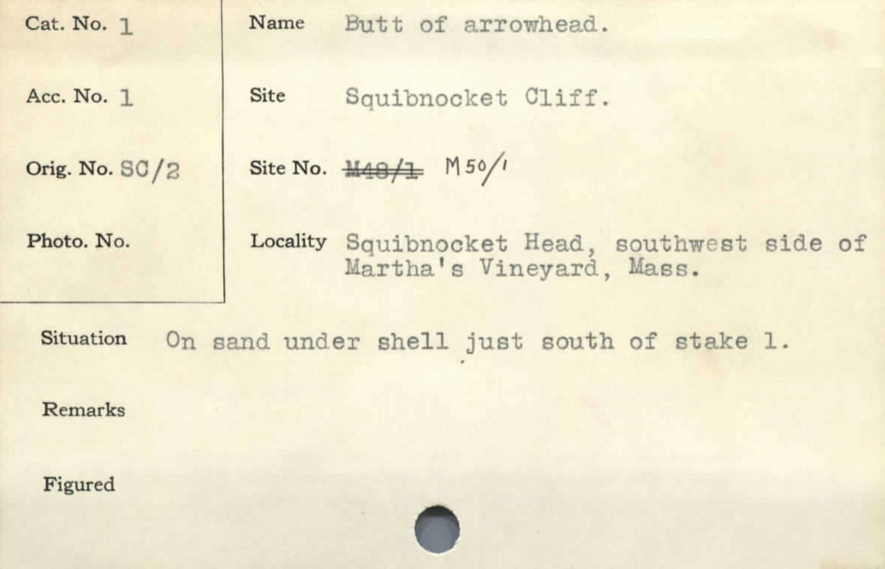

# Peabody Notecard Pipeline
The [peabody archeological museum](https://peabody.andover.edu) has thousands of typewritten notecards that index all objects in their possession. In order to help them with their indexing, I created an automatic OCR (Optical Character Recognition) pipeline. It takes all the notecards and converts them to an easily searchable csv. I further then helped in the creation of an internal, django website that allows for correction by workduty students. That code is not currently posted, but I can if interest is expressed.
### Example

#### Output:
{"CatNo":     '1',  
 "AccNo":     '1',  
 "OrigNo":    'SC/2',  
 "PhotoNo":   '',   
 "Name":      'Butt of arrowhead',  
 "Site":      'Squibnocket Cliff.',  
 "SiteNo":    'M50/1',  
 "Locality":  'Squibnocket Head, southwest side of Martha's Vineyard, Mass.',  
 "Situation": 'On sand under shell just south of stake 1.',
 "Remarks":   '',
 "Figured":   ''} 
